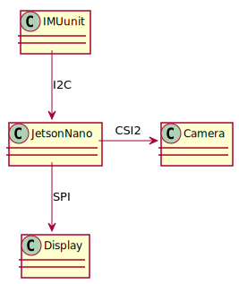

# Crash-scene-analyzer

The purpose of this application is to analyze crash events with the help of IMU sensors and Deep learning.
The application would use the IMU sensor values and perform a roll over detection. Upon detection, the camera sensor would be triggered to analyze the crash scene and collect meaningful information.

# objectives:
- Use OpenCV to analyze and collect information about the crash scene.
- Sensor interfacing and roll over detection.
- CUDA will be used to parallelize the deep learning application.
- A display device will be used for interactive messages
- QT and CUDA will be used to render display graphics

<!--
@startuml SimpleDesign
JetsonNano->Camera : CSI2 
IMUunit-down-> JetsonNano: I2C 
JetsonNano-down->Display: SPI
@enduml
-->
